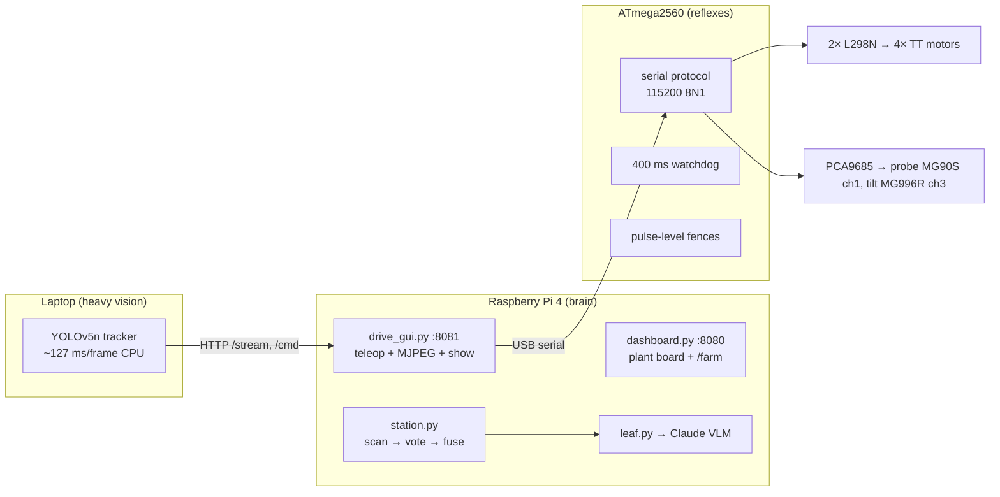

# Ceres — Architecture & Engineering Notes

The deep-dive companion to the README. Everything here is implemented and testable in
this repo unless explicitly marked as inherited design analysis.

## 1. System topology



## 2. Serial protocol and its timing model

ASCII, newline-terminated, request→`OK|ERR` reply. Commands: `PING FWD REV SPIN ARC
RARC STOP PROBE PAN TILT PANSPIN HOME STATUS`.

The safety-critical property is the interplay of three timers:

| Timer | Value | Consequence |
|---|---|---|
| motion burst | per-command `ms` ≤ 10 000 | no untimed motion exists |
| host watchdog | 400 ms since last RX byte | silent host ⇒ motors cut mid-burst |
| teleop repeat | client streams a 600 ms burst every 300 ms | continuous drive while held |

Result: releasing a button, losing WiFi, or a crashed client all converge to a stop in
≤ 600 ms without any cleanup code running anywhere. The GUI's status poll doubles as the
keepalive during long moves — liveness and telemetry are the same packet.

## 3. Joint fences: measured, then enforced at the lowest level

All servo writes funnel through one function that clamps in pulse space (µs), below the
command layer — so no code path, present or future, can exceed a limit:

- **Tilt 74°–118°.** The floor was found by successive approximation after the mechanism
  hammered its end-stop: lower the bound, listen, repeat. The passing value is the fence.
- **Probe window (pulse-domain, inverted map).** The rack runs mirrored to the original
  design assumption, so `PROBE 0 (retracted) = high pulse`, `PROBE 100 = low pulse`. The
  retracted-detection predicate and the drive interlock were re-derived for the inverted
  map — driving is refused unless the probe is *physically* up, not nominally up.
- **Per-channel slew limits** (µs/s) shape every motion; unused PCA9685 channels are
  actively silenced (zero pulse width) so a floating or failed servo cannot be driven.

## 4. Drivetrain control

Two L298N bridges, all 12 control pins independent, one motor per 2 A channel. Direction
polarity per motor lives in a firmware table (`FWD_HIGH[4]`) — the rear pair is inverted
there because bench testing showed mirror-image wiring; fixing it in the table beats
re-soldering under deadline. Arcs run the inner side at 40 % duty for car-like veers.
PWM is capped at 160/255: 3–6 V motors on an ~9 V post-bridge rail; 160/255 · 9 V ≈ 5.6 V
average at the motor.

After one MG996R's control board failed (it self-drives with no signal — retired), the
pan axis was re-architected onto the drivetrain: short differential spin bursts aim the
whole rover. The tracker compensates with a longer settle cooldown (§6).

## 5. Sensing → judgment

**Moisture** (Adafruit 4026, capacitive, I²C 0x36): raw counts two-point calibrated
(dry air = 0, submerged = 1) with plausibility bounds; a boot self-check makes a broken
probe read as FAULT, never as drought.

**Leaves**: 4 fenced camera poses per plant; each frame classified by a constrained-JSON
VLM call (verdict ∈ {healthy, anomalous, abstain}, cause ∈ {disease, pest}, confidence).
Voting: conviction requires ≥ 2 frames confidently anomalous; acquittal requires ≥ 2
confidently healthy and zero confident convictions; anything else abstains.

**Fusion** is a total function over {LOW, NORMAL, FAULT} × {HEALTHY, ANOMALOUS, UNKNOWN}
— nine explicit rules, thresholds MOISTURE_LOW = 0.35 and confidence floor 0.70. Design
property: no path converts uncertainty into an accusation; every uncertain cell lands on
UNDERWATERED-with-caveat or NEEDS_HUMAN. `python3 pi/triage.py` prints the table.

## 6. Visual servoing (laptop)

YOLOv5n (COCO class 58 "potted plant") through OpenCV DNN, letterboxed 640², ~127 ms/frame
CPU; falls back to HSV green-region segmentation for handheld leaves. Control: deadbands
0.10 (tilt) / 0.18 (pan) of frame; tilt corrects 2° per 320 ms; horizontal correction is a
250 ms spin burst with a 2.2 s cooldown (chassis motion shakes the camera — the loop waits
out its own disturbance). Pan polarity is **self-learning**: after each correction the
tracker checks whether horizontal error shrank; two consecutive regressions flip the
direction mapping at runtime.

## 7. Probe mechanism — inherited design analysis

The original probe drivetrain analysis (design documents; the CAD itself was lost before
this build): module 2, z = 18 pinion, Ø36 mm pitch circle — 0.314 mm of rack travel per
servo degree; MG996R stall derated to the 5.5 V rail gives 56.3 N of linear force against
a 21.9 N moist-soil insertion load (SF 2.57); Lewis tooth stress 7.59 MPa (SF 2.37 in
PETG); guided-blade buckling SF > 100. The current build substitutes an MG90S (~12 N at
stall through the same pinion) at the builder's direction — sufficient only for loose
potting mix, and recorded as such rather than re-rated.

## 8. Power tree

```
3S LiPo (11.1 V, 30C) ─┬─► L298N #1 ─► L298N #2      (motor rail, daisy-chained)
                       └─► buck → 6.0 V ─► PCA9685 V+ (servo rail, own return path)
power bank ─► Pi (USB-C) ─► Mega (USB data+power)
single common ground; servo current returns via the PCA9685 terminal block,
never through the Mega/USB ground (learned the hard way — see failure ledger)
```

## 9. Failure ledger with root causes

| Failure | Root cause | Response |
|---|---|---|
| L298P shield dead | reversed battery polarity at BAT terminals | dual-L298N architecture; polarity ritual |
| Serial corruption / USB dropouts | servo return current through USB ground + cable | ground re-route; on-board choreography; link-quality PING metric (n/60) |
| Wheels fought on every command | rear motors wired mirror-image | firmware polarity table |
| Tilt hammering | commanded past unmeasured mechanical floor | successive-approximation calibration → fence |
| Servo self-drives unpowered inputs | fried control board (confirmed: spins with zero pulses) | retired; wheels became pan axis |
| Twitch at power-on | MCU boot window leaves EN pins floating | battery-last power order; pull-down fix documented |

## 10. Verification

46 tests, all runnable on the target Pi (`cd pi && pytest tests`): protocol framing and
error taxonomy, watchdog-keepalive behavior, every fusion cell and both thresholds at
their boundaries, calibration bounds and fault paths, vision abstention on seven failure
modes, scan-pose fencing and vote outcomes. Firmware compiles warning-clean for
`arduino:avr:mega`; every flash in the log was verified by avrdude readback.
