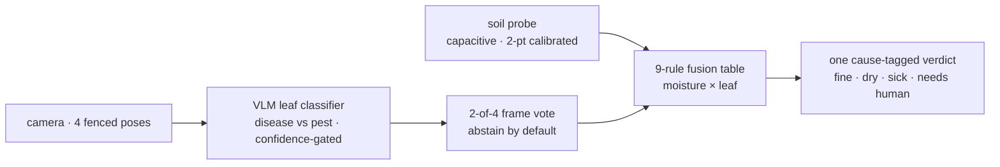
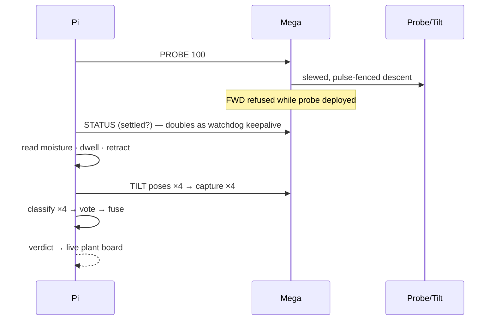

# CERES — Field Triage Rover

**A rover that tells you *why* a plant is suffering — thirst, disease, or pests — by
probing the soil, studying the leaves, and fusing both into one honest verdict per plant.**

Built by **Rishith Chennupati & Varun Chilukuri** for the Berkeley Robotics Hackathon.
Deep technical companion: **[ARCHITECTURE.md](ARCHITECTURE.md)** · agent index: **[llms.txt](llms.txt)**

Every plant monitor gives you numbers. Ceres gives you a diagnosis — and when it isn't
sure, it says **"needs a human"** instead of guessing. Abstention is a feature.

---

## How it thinks

And one full plant stop, as the machines see it:

The fusion table is explicit and total — a judge asking "what happens at moisture 0.42
and leaf confidence 0.55?" gets a table lookup, not a vibe. Run `python3 pi/triage.py`
to print it.

## The machine

| Layer | Hardware | Job |
|---|---|---|
| Reflexes | Arduino Mega 2560 | serial protocol, timed motion, 400 ms host watchdog, per-joint safety fences |
| Drivetrain | 2× L298N, 4× TT motors | skid-steer: fwd/rev/spin/arc (12-pin independent wiring) |
| Actuators | PCA9685 → MG90S probe (rack & pinion), MG996R tilt | fenced travel measured on the real hardware |
| Brain | Raspberry Pi 4 (USB-boot) | camera, web GUI + dashboards (systemd), vision pipeline, serial master |
| Heavy vision | laptop over WiFi | YOLOv5n plant tracking (~127 ms/frame), closes a visual-servo loop on the turret |

Web surfaces served by the rover's own Pi (no cloud required):
`:8081` Rover Remote — phone teleoperation, live MJPEG feed, hold-to-drive, one-button
kinematic show · `:8080` live plant board · `:8080/farm` the Farm Board display.

## Safety, by construction

- No untimed motion; every drive command auto-stops; host silence >400 ms cuts motors
- Probe and tilt clamped **at the pulse-write level** to travel limits measured on the
  physical mechanism (the tilt limit was found by successive approximation after it
  hammered its stop — the number is earned, not assumed)
- Driving is refused while the probe is deployed, and vice versa
- 46 automated tests, all passing on the Pi itself: `cd pi && pytest tests`

## Honest ledger

Things that broke and what we did (full narrative in [STATUS.md](STATUS.md)):
- The original L298P motor shield died to reversed battery polarity → dual-L298N architecture
- One MG996R's control board fried (self-drives on bare power) → **retired; the wheels
  became the pan axis** — short spin bursts aim the whole rover
- Rear motors were wired mirror-image → fixed in the firmware direction table
- Campus-network USB noise corrupted serial during streaming → choreography moved on-board
- Not yet done: leaf vision against the live API (needs a key), soil sensor soldering,
  drivetrain on real soil, probe rack limit calibration

## Provenance

This repo's git history **is** the build card: everything before the hackathon's kickoff
commit existed before the event, and everything after was built during it. The probe
module CAD from the original design was lost and is documented as such — nothing here
claims to be more finished than it is.

## Repo map

`firmware/` Mega sketches (rover_motion is the real one; the rest are bench tools) ·
`pi/` the brain: driver, fusion, calibration, vision, GUI, dashboards, 46 tests ·
`mac_tools/` neural leaf tracking · `cad/` surviving chassis CAD + mock assembly ·
`HANDOFF.md` the original design document · `STATUS.md` the living build log
